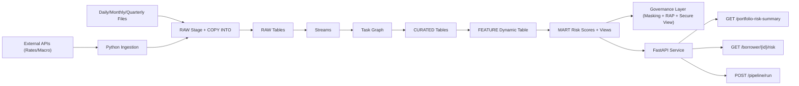

# Mortgage Batch Risk Intelligence Platform on Snowflake

An enterprise-style mortgage risk analytics project demonstrating deep Snowflake capabilities: batch ingestion (daily/monthly/quarterly), CDC with Streams, Task orchestration, Dynamic Tables, governance policies, retention controls, and API integration.

## Business Problem

Mortgage portfolios need periodic risk monitoring across borrower delinquency, LTV stress, and regional concentration.  
This project builds a production-style batch pipeline to ingest files at multiple cadences, transform incrementally, score borrower risk, and serve results through APIs.

## What This Project Demonstrates

- Multi-cadence file ingestion (`daily`, `monthly`, `quarterly`)
- Snowflake layered architecture (`RAW -> CURATED -> FEATURE -> MART -> GOV/OPS`)
- Incremental processing with `Streams + Tasks`
- Dynamic feature computation with `Dynamic Tables`
- Risk scoring with stored procedure
- Governance with `Masking Policy`, `Row Access Policy`, `Tags`, and `Secure View`
- Operational controls for file retention/archival
- Outbound APIs with FastAPI (`/portfolio-risk-summary`, `/borrower/{id}/risk`, `/pipeline/run`)
- Inbound API integration (external macro/rates loader script)

## Architecture

## Data Ingestion Cadence

- Daily files: payment-level mortgage activity
- Monthly files: mortgage snapshot metrics (LTV/balance/rate)
- Quarterly files: portfolio performance by region/product

## Retention Policy

- Daily files: 90 days
- Monthly files: 24 months
- Quarterly files: 7 years
- Retention states are tracked in OPS.file_ingestion_control with automated status updates (ACTIVE, ARCHIVE_READY, DELETE_READY).

## API Endpoints

- GET /portfolio-risk-summary
- GET /borrower/{borrower_id}/risk
- POST /pipeline/run

## Swagger UI:

http://127.0.0.1:8000/docs

## Setup

- Create Snowflake objects (warehouses, DB, schemas, tables, stage, policies, tasks).
- Upload daily/monthly/quarterly sample files into stage subfolders.
- Run COPY INTO into RAW tables.
- Backfill CURATED once (initial run), then rely on streams/tasks for incrementals.
- Build features + scoring using dynamic table + stored procedure.
- Run API : uvicorn api.app:app --reload --port 8000

## Validation

- Portfolio summary endpoint returns risk distribution
- Borrower endpoint returns latest risk record
- Pipeline endpoint triggers scoring successfully
- Governance policies apply role-based masking/filtering

## Notes

- External API ingestion script is included (ingestion/load_external_apis.py).
- If API keys are missing, external rows may be 0 (expected in dev mode).